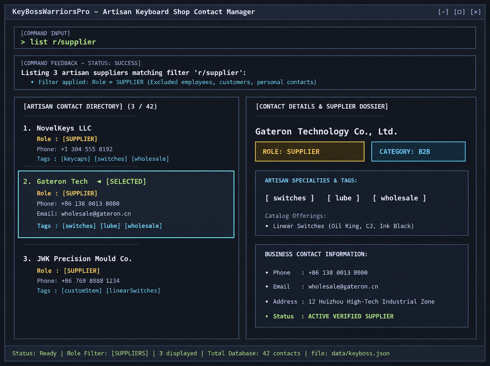

# KeyBossWarriorsPro

### Our Story
KeyBossWarriorsPro is a desktop application for managing contacts for an artisan keyboard shop. It helps users keep track of suppliers, employees, customers, and other personal contacts, with support for organizing and finding contacts using tags.

### Features

- Manage contact details such as names, phone numbers, email addresses, and tags.

### Acknowledgements

This project is based on the AddressBook-Level3 project created by the [SE-EDU initiative](https://se-education.org).

### Getting started

For installation instructions, usage examples, and the complete command reference, see the [User Guide](docs/UserGuide.md).

For information about the project’s design and implementation, see the [Developer Guide](docs/DeveloperGuide.md).