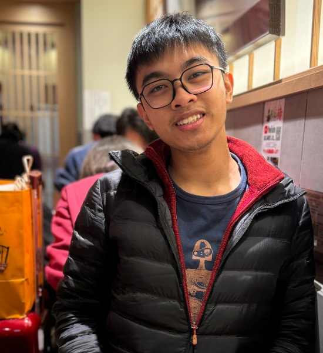
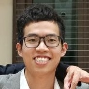
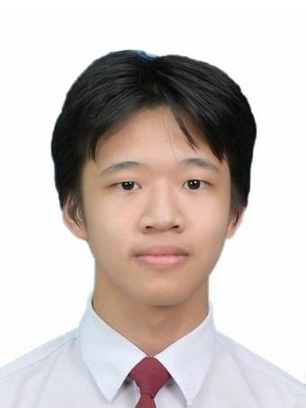
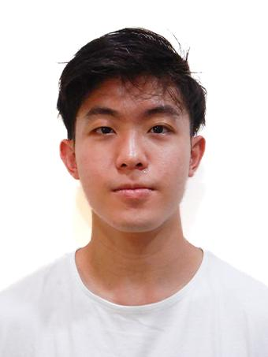

We are team **CS2103T-F11-1** based in the [School of Computing, National University of Singapore](https://www.comp.nus.edu.sg).

## Project Team

### Kieran M

[[homepage](https://kimame04.github.io)]
[[github](https://github.com/Kimame04)]
[[portfolio](team/kimame04.md)]

* Role: Developer
* Responsibilities: Documentation, UI & Integration

### Xavier

[[github](https://github.com/chiacxx)]
[[portfolio](team/chiacxx.md)]

* Role: Developer
* Responsibilities: Logic & Architecture

### Chester

[[github](https://github.com/chester-wong-33)]
[[portfolio](team/johndoe.md)]

* Role: Developer
* Responsibilities: Model & Data Validation

### Noah

[[github](https://github.com/Noyoth)]
[[portfolio](team/johndoe.md)]

* Role: Developer
* Responsibilities: Storage & Data Persistence

### Ken Tay

[[github](https://github.com/Ken-Tat)]

* Role: Developer
* Responsibilities: Testing & DevOps
