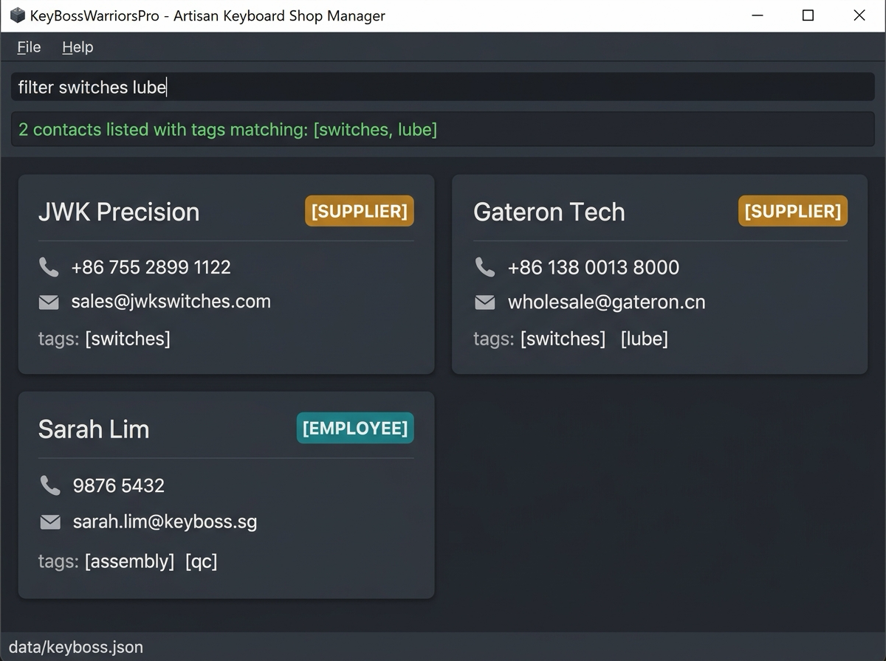

**KeyBossWarriorsPro is a specialized desktop contact and vendor management application tailored for Artisan Mechanical Keyboard Shop Managers.** Optimized for keyboard-centric operations, it delivers the speed of a Command Line Interface (CLI) alongside the visual clarity of a Graphical User Interface (GUI).

### Key Features
* **Associate Registry with Role Classification (`add`, `edit`, `delete`)**: Maintain a central, validated registry of all workshop contacts (names, phones, emails, physical addresses), strictly categorized into **Suppliers**, **Service Providers**, or **Employees** to prevent operational misrouting.
* **Hardware Component & Service Tagging (`t/TAG`)**: Tag suppliers with specific keyboard parts (e.g. `switches`, `pcbs`, `keycaps`, `stabilizers`, `lube`) and manufacturing partners with specialized service tags (e.g. `anodizing`, `laser-engraving`, `soldering`).
* **Instant Name Querying (`find`)**: Retrieve partner contacts in seconds using fast, case-insensitive substring searching across full or partial business or staff names.
* **Consumable & Service Filtering (`filter`)**: Quickly find alternative part sources or machining contractors when inventory runs low by filtering with one or more tags (e.g. `filter switches lube`).
* **Compact Tabular Review (`list`)**: Inspect all associates, phone/email endpoints, color-coded role badges, and tags in a clean, keyboard-friendly tabular CLI view.
* **Zero-Setup Data Persistence & Bootstrapping**: Automatically commits every modification to local JSON storage without manual export commands, and automatically loads records with graceful corrupted-file fallbacks on startup.
* **CLI Command Cheatsheet (`help`, `exit`)**: Built-in syntax summaries and parameter guides accessible directly from the CLI, with clean keyboard-driven exit.

### Getting Started
* If you are interested in using KeyBossWarriorsPro, head over to the [_Quick Start_ section of the **User Guide**](UserGuide.html#quick-start).
* If you are interested in developing or contributing to KeyBossWarriorsPro, the [**Developer Guide**](DeveloperGuide.html) is a good place to start.
* Meet our development team on the [**About Us**](AboutUs.html) page.

---

**Acknowledgements**
* Based on the AddressBook-Level 3 project created by the [SE-EDU initiative](https://se-education.org).
* Libraries used: [JavaFX](https://openjfx.io/), [Jackson](https://github.com/FasterXML/jackson), [JUnit5](https://github.com/junit-team/junit5).
